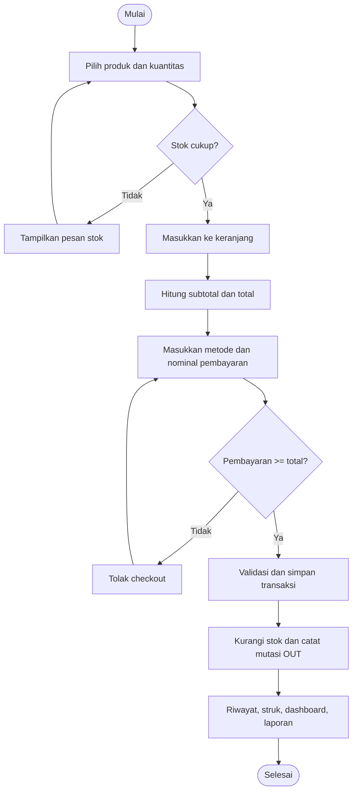
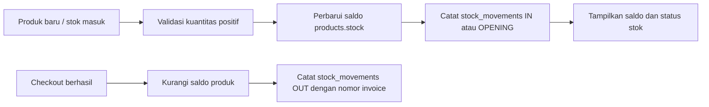
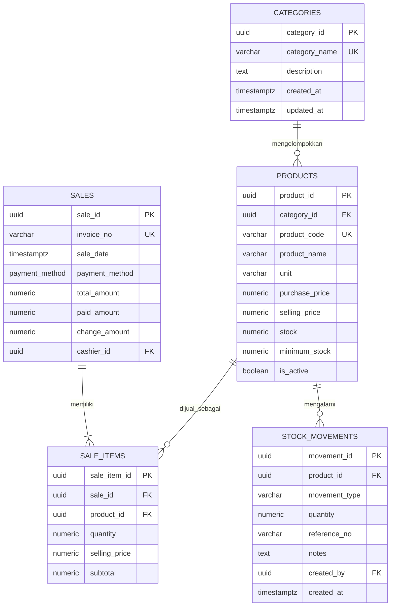

# RetailPro V4

> Sistem informasi penjualan dan persediaan untuk toko retail/sembako. Aplikasi menyediakan pencatatan transaksi, pemantauan stok, dan laporan operasional dengan dua pilihan penyimpanan: Supabase PostgreSQL atau demo lokal di browser.

## Daftar Isi

- [Gambaran Umum](#gambaran-umum)
- [Fitur](#fitur)
- [Teknologi dan Struktur Proyek](#teknologi-dan-struktur-proyek)
- [Menjalankan Aplikasi](#menjalankan-aplikasi)
- [Konfigurasi Supabase](#konfigurasi-supabase)
- [Modul dan Alur Kerja](#modul-dan-alur-kerja)
- [Skema Basis Data](#skema-basis-data)
- [ERD](#erd)
- [Aturan Bisnis dan Kontrol](#aturan-bisnis-dan-kontrol)
- [Mode Penyimpanan](#mode-penyimpanan)
- [Batasan Sistem](#batasan-sistem)
- [Pengembangan dan Pemecahan Masalah](#pengembangan-dan-pemecahan-masalah)

## Gambaran Umum

RetailPro V4 adalah aplikasi web untuk mengelola katalog barang, transaksi penjualan, serta saldo dan pergerakan stok. Sistem ditujukan untuk membantu operasi toko dan menyediakan jejak data yang mendukung pengawasan penjualan dan persediaan.

Sistem memiliki dua mode operasi:

| Mode | Penyimpanan | Kegunaan |
| --- | --- | --- |
| Supabase | PostgreSQL melalui Supabase Data API dan fungsi RPC | Penyimpanan terpusat untuk penggunaan yang terhubung ke backend. |
| Demo Lokal | `localStorage` pada browser | Mencoba fitur frontend tanpa backend; data hanya tersedia pada browser/perangkat yang menyimpannya. |

## Fitur

- Dashboard dengan ringkasan produk, saldo stok, penjualan, jumlah transaksi, stok menipis, dan transaksi terbaru.
- Pengelolaan kategori dan produk, termasuk kode, satuan, harga beli, harga jual, stok minimum, dan status aktif.
- Penambahan stok beserta tipe mutasi dan catatan.
- Indikator persediaan: **AMAN**, **MENIPIS**, dan **HABIS**.
- Keranjang penjualan dengan kuantitas, harga, subtotal, metode pembayaran, nominal dibayar, dan kembalian.
- Metode pembayaran: CASH, QRIS, atau TRANSFER.
- Nomor invoice unik pada mode Supabase dan nomor transaksi demo pada mode lokal.
- Pengurangan stok dan pencatatan mutasi OUT setelah checkout berhasil.
- Riwayat penjualan, cetak struk, laporan penjualan/persediaan, ekspor, dan pencetakan.

## Teknologi dan Struktur Proyek

Frontend dibuat menggunakan HTML, CSS, dan JavaScript tanpa framework frontend. Backend menggunakan Supabase PostgreSQL, SQL, dan fungsi PL/pgSQL RPC.

```text
retail-inventory-system/
├── README.md
├── backend/
│   ├── SQL/
│   │   ├── 01_schema.sql    # Tipe data, tabel, indeks, trigger, RLS, invoice
│   │   ├── 02_rpc.sql       # Transaksi penjualan dan penambahan stok
│   │   └── 03_seed.sql      # Kategori dan produk contoh
│   └── SUPABASE/
│       └── README.md        # Langkah setup Supabase
└── frontend/
	├── HTML/
	│   ├── index.html       # Halaman utama aplikasi
	│   └── login.html       # Halaman masuk demo
	├── CSS/
	│   ├── style.css
	│   └── print.css
	└── JS/
		├── app.js           # Modul antarmuka dan alur aplikasi
		├── auth.js          # Navigasi login demo
		└── config.js        # Konfigurasi Supabase
```

## Menjalankan Aplikasi

### Mode Demo Lokal

1. Buka folder proyek di VS Code.
2. Jalankan `frontend/HTML/index.html` menggunakan ekstensi Live Server atau server statis lokal.
3. Pastikan konfigurasi Supabase tidak aktif/kosong agar aplikasi memakai demo lokal.
4. Data demo dan perubahan yang dibuat disimpan pada `localStorage` browser.

> Mode demo tidak memerlukan backend, tetapi data tidak tersinkronisasi antarperangkat dan dapat hilang jika penyimpanan browser dibersihkan.

### Mode Supabase

1. Buat project Supabase dan buka **SQL Editor**.
2. Jalankan skrip secara berurutan:
   1. `backend/SQL/01_schema.sql`
   2. `backend/SQL/02_rpc.sql`
   3. `backend/SQL/03_seed.sql`
3. Salin URL project dan publishable/anon key dari pengaturan API Supabase.
4. Isi nilai `SUPABASE_URL` dan `SUPABASE_ANON_KEY` di `frontend/JS/config.js`.
5. Jalankan `frontend/HTML/index.html` melalui Live Server.

> Jangan pernah menaruh `service_role` key di frontend. Kebijakan RLS yang ada saat ini merupakan konfigurasi demo dan perlu diperketat sebelum aplikasi digunakan dengan data produksi.

## Konfigurasi Supabase

`frontend/JS/config.js` mengaktifkan mode Supabase apabila URL dan key terlihat telah diisi. Bentuk konfigurasi dasarnya:

```js
const SUPABASE_URL = "https://<project-ref>.supabase.co";
const SUPABASE_ANON_KEY = "<publishable-or-anon-key>";
```

File frontend dapat diunduh browser, sehingga hanya key publik Supabase yang boleh digunakan di sana. Keamanan data harus ditegakkan melalui RLS, hak akses fungsi, dan kebijakan backend, bukan dengan menyembunyikan nilai key publik.

## Modul dan Alur Kerja

### Master kategori dan produk

Kategori menjadi pengelompokan wajib bagi produk. Kode produk dan nama kategori harus unik. Produk memiliki harga beli, harga jual, saldo stok, batas minimum, satuan, dan penanda aktif. Produk yang telah dirujuk transaksi atau mutasi stok dipertahankan dengan cara dinonaktifkan, bukan dihapus agar histori tetap dapat dibaca.

### Penjualan

Operator memilih barang dan jumlahnya, memasukkan keranjang, lalu menentukan metode pembayaran dan nominal yang diterima. Aplikasi menolak kuantitas tidak valid, pembayaran yang kurang, produk nonaktif, dan stok yang tidak mencukupi. Setelah berhasil, sistem menyimpan header transaksi, detail barang, mengurangi stok, membuat catatan mutasi OUT, lalu menyediakan nomor transaksi dan struk.



Pada mode Supabase, proses utama dilakukan oleh RPC `create_sale`. Fungsi ini mengunci produk selama validasi stok, menghitung total berdasarkan harga jual produk, menghasilkan nomor invoice, menyimpan `sales` dan `sale_items`, mengurangi `products.stock`, serta menulis `stock_movements` bertipe OUT. Operasi RPC dijalankan sebagai satu transaksi database.

### Persediaan

Penambahan stok dilakukan dengan memilih produk, mengisi kuantitas positif, lalu menyertakan catatan bila diperlukan. Mode Supabase memanggil RPC `add_stock`; fungsi menambah saldo produk dan menulis mutasi. Penjualan mengurangi saldo secara otomatis.



Status stok dihitung dari saldo terhadap batas minimum:

| Kondisi | Status |
| --- | --- |
| `stock <= 0` | HABIS |
| `stock > 0` dan `stock <= minimum_stock` | MENIPIS |
| `stock > minimum_stock` | AMAN |

## Skema Basis Data

Skema Supabase menggunakan lima tabel utama. `PK` berarti primary key, `FK` berarti foreign key, dan `UQ` berarti unik.

| Tabel | Kolom penting | Fungsi |
| --- | --- | --- |
| `categories` | `category_id` PK, `category_name` UQ, `description`, `created_at`, `updated_at` | Master kategori produk. |
| `products` | `product_id` PK, `category_id` FK, `product_code` UQ, `product_name`, `unit`, `purchase_price`, `selling_price`, `stock`, `minimum_stock`, `is_active` | Master produk dan saldo stok terkini. Harga dan stok dibatasi agar tidak negatif. |
| `sales` | `sale_id` PK, `invoice_no` UQ, `sale_date`, `payment_method`, `total_amount`, `paid_amount`, `change_amount`, `cashier_id` FK opsional | Header transaksi penjualan dan pembayaran. Metode pembayaran menggunakan enum CASH, QRIS, atau TRANSFER. |
| `sale_items` | `sale_item_id` PK, `sale_id` FK, `product_id` FK, `quantity`, `selling_price`, `subtotal` | Rincian produk dalam transaksi. `subtotal` dihitung database dari `quantity * selling_price`. |
| `stock_movements` | `movement_id` PK, `product_id` FK, `movement_type`, `quantity`, `reference_no`, `notes`, `created_by` FK opsional, `created_at` | Jejak perubahan stok bertipe OPENING, IN, OUT, atau ADJUSTMENT. |

Relasi utama:

- Satu kategori memiliki banyak produk; satu produk wajib berada dalam satu kategori.
- Satu transaksi memiliki banyak baris detail; satu baris detail merujuk satu produk.
- Satu produk dapat tampil pada banyak detail penjualan.
- Satu produk dapat memiliki banyak catatan mutasi stok.
- `sales.cashier_id` dan `stock_movements.created_by` merujuk pengguna Supabase dan boleh kosong.

## ERD

Diagram berikut menggambarkan relasi pada skema SQL Supabase. Hubungan `sales` ke `products` terjadi melalui tabel perantara `sale_items`.



### Arti relasi dan aturan penghapusan

- **`categories` 1:N `products`:** `products.category_id` adalah FK wajib. Kategori yang masih dipakai tidak dapat dihapus (`ON DELETE RESTRICT`).
- **`sales` 1:N `sale_items`:** detail penjualan bergantung pada header; penghapusan header akan menghapus detail (`ON DELETE CASCADE`).
- **`products` 1:N `sale_items`:** satu produk dapat tercatat berkali-kali pada detail transaksi. Produk yang telah digunakan tidak dapat dihapus secara fisik (`ON DELETE RESTRICT`).
- **`products` 1:N `stock_movements`:** setiap mutasi merujuk produk. Riwayat mutasi mencegah penghapusan produk secara fisik.
- Kolom harga jual pada `sale_items` menyimpan harga pada saat transaksi; perubahan harga master di kemudian hari tidak mengubah histori penjualan.
- `products.stock` adalah saldo yang digunakan aplikasi. `stock_movements` menyimpan jejak mutasi, bukan saldo hasil penjumlahan yang dihitung otomatis oleh query.

## Aturan Bisnis dan Kontrol

- Kode invoice unik. Di Supabase, nomor dibuat dengan format `INV-YYYYMMDD-NNNNN` menggunakan sequence database.
- Keranjang penjualan tidak boleh kosong; kuantitas harus lebih dari nol.
- Hanya produk aktif dengan stok cukup yang dapat dijual.
- Pembayaran minimal sebesar total transaksi. Kembalian dihitung sebagai `paid_amount - total_amount`.
- Total transaksi pada RPC dihitung ulang dari kuantitas dan harga jual produk di database.
- Transaksi penjualan menulis header, detail, perubahan stok, dan mutasi OUT dalam satu pemanggilan RPC.
- `sale_items.subtotal` adalah kolom terhitung: `quantity * selling_price`.
- Harga, stok, kuantitas, pembayaran, dan total memiliki constraint validasi pada skema database.
- Timestamp kategori dan produk diperbarui oleh trigger `set_updated_at`.

## Mode Penyimpanan

| Hal | Supabase | Demo Lokal |
| --- | --- | --- |
| Persistensi | PostgreSQL terpusat | `localStorage` browser |
| Nomor transaksi | Sequence database | ID demo berbasis waktu |
| Penguncian stok saat transaksi | Ya, melalui `SELECT ... FOR UPDATE` di RPC penjualan | Tidak ada penguncian lintas tab/perangkat |
| RPC | `create_sale`, `add_stock` | Proses dilakukan pada JavaScript frontend |
| Berbagi data antarperangkat | Ya, jika konfigurasi dan akses benar | Tidak |
| Autentikasi pengguna | Integrasi referensi Supabase tersedia pada skema, namun aplikasi saat ini tidak mengimplementasikan login terverifikasi | Tidak ada |

Pilih Supabase untuk data terpusat. Mode lokal cocok untuk demonstrasi dan pengujian tampilan, bukan sebagai sumber data bersama untuk operasional banyak pengguna.

## Batasan Sistem

RetailPro V4 berfokus pada siklus penjualan dan persediaan. Walaupun memuat harga beli produk dan nilai penjualan, sistem belum mencakup seluruh proses akuntansi dan tidak boleh dianggap sebagai sistem buku besar.

- Belum tersedia modul pemasok, pesanan pembelian, penerimaan pembelian, atau utang usaha.
- Belum tersedia jurnal umum, bagan akun, buku besar, piutang, rekonsiliasi, atau laporan keuangan.
- Belum ada metode penilaian persediaan seperti FIFO atau rata-rata tertimbang; HPP dan laba kotor akuntansi tidak dihitung.
- Tipe mutasi ADJUSTMENT diterima `add_stock`, tetapi fungsi menambah kuantitas seperti tipe masuk. Koreksi stok negatif belum tersedia.
- RPC mengisi `cashier_id` dan `created_by` dengan `NULL`; atribusi pengguna belum aktif.
- Kebijakan RLS dalam skrip ditujukan untuk demo dan mengizinkan akses luas ke peran `anon`/`authenticated`. Kebijakan ini harus diubah sebelum menyimpan data produksi.
- Login saat ini hanya navigasi ke halaman aplikasi; belum memeriksa kredensial pengguna.

## Pengembangan dan Pemecahan Masalah

### Urutan perubahan database

Jika struktur tabel berubah, sesuaikan SQL schema dan kode aplikasi terkait. Untuk instalasi baru, jalankan kembali skrip dalam urutan `01_schema.sql`, `02_rpc.sql`, lalu `03_seed.sql`. Uji fungsi transaksi dan kebijakan RLS pada project Supabase non-produksi sebelum deployment.

### Masalah umum

| Gejala | Pemeriksaan |
| --- | --- |
| Aplikasi tetap berada di mode demo | Periksa URL/key di `frontend/JS/config.js`, koneksi internet, dan pemuatan Supabase client di halaman HTML. |
| Data lokal tidak sama dengan data Supabase | Pastikan mode aktif; data lokal dan Supabase adalah penyimpanan yang terpisah dan tidak tersinkronisasi otomatis. |
| Skrip SQL gagal | Jalankan skrip sesuai urutan dan periksa pesan error di Supabase SQL Editor. RPC bergantung pada tabel dari `01_schema.sql`. |
| Checkout gagal karena stok | Muat ulang data produk dan pastikan saldo memenuhi jumlah keranjang. Periksa juga bahwa produk masih aktif. |
| Key terlihat pada kode frontend | Hanya gunakan publishable/anon key. Jangan pernah memakai service-role key di browser; atur akses melalui RLS. |

### Referensi implementasi

- Skema tabel, indeks, trigger, sequence invoice, dan RLS: `backend/SQL/01_schema.sql`.
- RPC transaksi dan persediaan: `backend/SQL/02_rpc.sql`.
- Data kategori dan produk contoh: `backend/SQL/03_seed.sql`.
- Setup Supabase tambahan: `backend/SUPABASE/README.md`.
- Logika frontend dan mode penyimpanan: `frontend/JS/app.js`.
